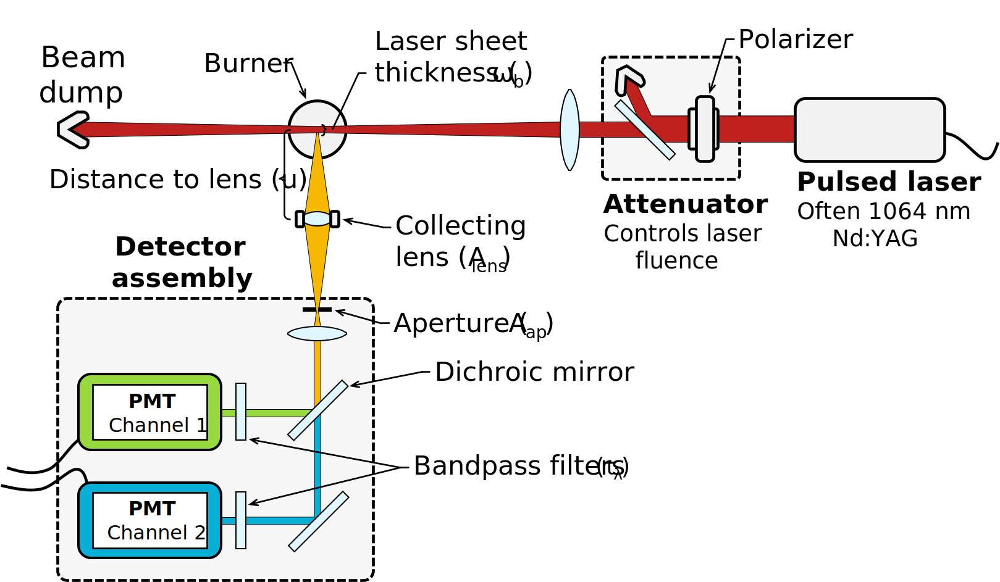
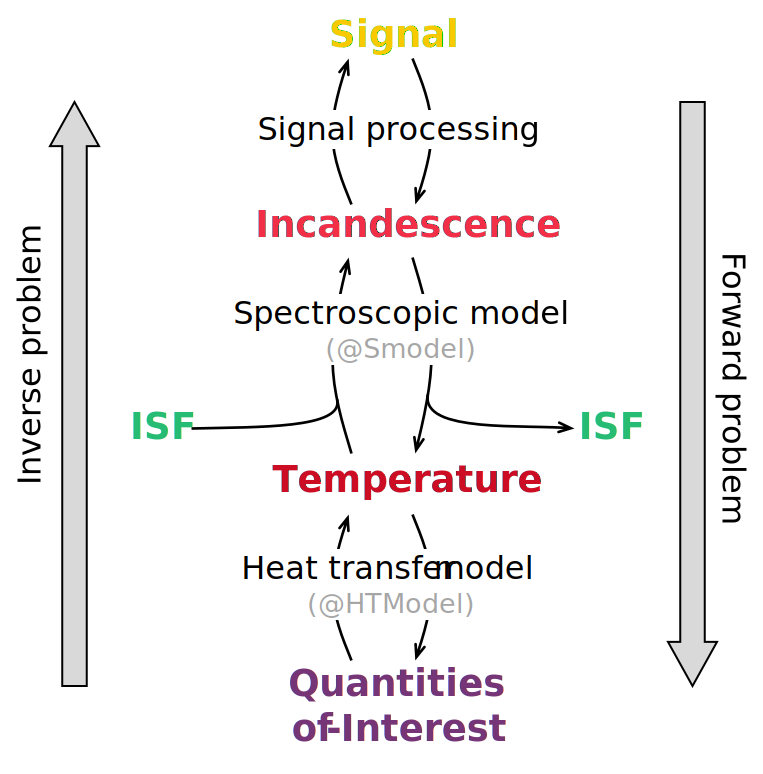
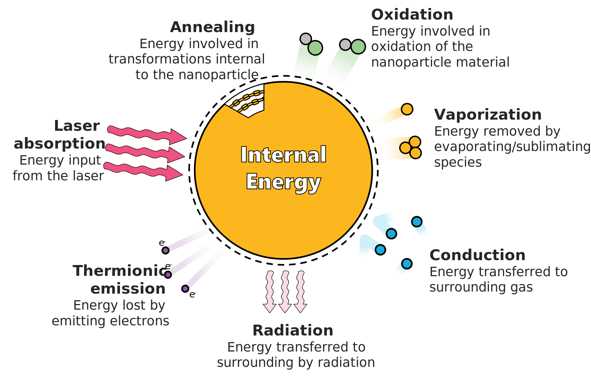

# MODUlar LII Modeler (moduliim)

> NOTE: This code is an experimental code.

This is modular program to model and analyze time-resolved laser-induced incandescence (TiRe-LII) signals, initially developed at the University of Waterloo with extensions added subsequently.

This program is built to simulate signals from various materials, including soot, silicon, germanium, iron, silver, and molybdenum. Signals are generated predominantly using absorption, conduction, and evaporation submodels, with capabilities to do other cooling modes. A typical TiRe-LII apparatus is shown below ([Sipkens, 2017][SipkensThesis]; [Sipkens et al., 2022][SipkensReview]). 

<p align="left">
  
</p>


## Getting started

In addition to the base MATLAB, this codebase makes use of the following MATLAB packages: **syms**, **statistics_toolbox**, ...

Further details will be added at a later date.

Note that times are defined relative to the center of the laser pulse intensity (or the peak of the signals, if heating/absorption is not modeled). This allows modeling of the initial portion of the temperature decay for polydisperse particle size distributions. In these cases, this allows for modeling of the later portion of the signals, while ignoring anomalous cooling at the beginning of some signals (e.g., molybdenum or some carbon cases). 

## 1. Data structure

Data, including temperatures and incandescence intensities, are generally structured with: 

1. **time** in the first dimension, e.g., `J(:,1,1)` will be the temporally-resolved incandescence at the first wavelength; 
2. **repeats** to be used for statistics in the second dimension; and, 
3. specific to intensities, **wavelength** in the third dimension.

While having the third dimension as wavelength is suboptimal in some respects, it consistently reserves the second dimension for repeat measurements, whether the represented quantity be incandescence, temperature, or intensity scaling factor (similar to apparent volume fraction). This has utility for uncertainty quantification. 

Note that the **repeats** dimension can also be used to store fluence-resolved temperature and incandescence curves in the absence of repeat data (or when signals are pre-averaged).

## 2. Upper directory and main\*.m scripts

Throughout the program, `main*.m` scripts are used to create instances of the classes and perform the analysis of LII signals. 

## 3. Classes

The typical, overall TiRe-LII analysis procedure is shown schematically below  ([Sipkens, 2017][SipkensThesis]). 

<p align="left">
  
</p>


This code contains two classes that are used to define the two heat transfer and spectroscopic components of the overall TiRe-LII model. 

### Heat transfer model (@HTModel)

This class is designed to generate temperature decay curves, implementing several heat transfer submodels, shown schematically below  ([Sipkens, 2017][SipkensThesis]; [Sipkens et al., 2022][SipkensReview]).

<p align="left">
  
</p>

This is done by solving, at the very least, an ordinary differential equation for temperature. Mass and annealed fraction can also be solved simultaneously.

One can create an instance of the `HTModel` class by calling the construction method:

```Matlab
htmodel = HTModel(prop, x_fields, t, opts);
```

The inputs to the instructor method are as follows:

1. `prop` -  is a MATLAB structure that contains all of the physical parameters required to define the heat transfer model. Generating of this structure is described in more detail in [3.1 +props](#31-props), with the precise contents depending on the chosen form of the heat transfer (e.g., whether or not it includes evaporation/sublimation).

2. The parameter `x_fields` then contains a cell of strings, where each entry is a property of the given `prop` structure.

3. The `t` input is a vector of time for which the heat transfer model will be evaluated.

4. Finally, various aspects of the `HTModel` class are controlled using an `opts` structure, which becomes a property of the object. This includes which heat transfer submodels are used in constructing the ordinary differential equation to solve.

The two key methods for evaluating the heat transfer model are the `evaluate` and `de_solve` methods. The `de_solve` method solves the ODEs without altering the default physical properties. In contrast, the `evaluate` method solves the ODEs for a vector of property values given by the `x` input to the method. The latter is particularly useful in optimization scenerio.

### Spectroscopic model (@SModel)

This class is design to simulate incandescence from a temperature trace, incorporating blackbody radiation and the optical properties. Methods exist to both forward and backward (i.e. pyrometry) calculations.

Instances of the class are created following a similar procedure to `HTModel`. For example, one can create an instance of the class using

```Matlab
smodel = SModel(prop, x_fields, t, l);
```

The inputs are largely the same as the `HTModel` class, but with an added `l` argument that defines the wavelengths relevant to the experiment.

## 4. Packages

Program-specific packages bundle similar functions. Packages functions are contained in folders starting with the **+** symbol and are accessed by starting the function call with the folder name (excluding the "+" symbol).

### +props

This class contains the thermosphysical, optical, and other model parameters to be used in evaluating both the spectroscopic and heat transfer models. These parameters are also the ones that can be selected as dependent variables when creating instances of the `HTModel` and `SModel` classes. 

> NOTE: This package replaces the @Prop class in previous versions to allow for more dynamic/flexible structures. Properties are now containing in MATLAB structures, coupled with the **+props** package, which replaces the method in the original class. 

Some basic naming conventions are as follows: 

**1. (eq)** Functions that start with `props.eq_*(...)` indicate methods that describe functional dependencies of some material properties, e.g., the temperature dependence of various properties using expressions like the Clausius-Clapeyron or Tolman equations.

**2. (x)** Functions that start with `props.x_*()` indicate methods that describe experimental parameters, such as gas pressure and temperature, for a specific set of experiments. 

**3.** Function that evaluate material properties for a specific gas of nanoparticle material are named according to their chemical symbol, e.g., `props.Fe()` for iron or `props.C()` for carbon/soot.

### +tools

This package contains an assortment of other utilities, including a text-based progress bar and  a function to parse the inputs of various functions.

### +uq

This package contains a set of utilities for simulating and interpreting noise in TiRe-LII signals. This includes utilities that can be used for uncertainty quantification (UQ).

### +data

The data package is available to filter or otherwise process TiRe-LII signals. For example, the `get_peak_temp` function used a spectroscopic model to estimate the peak temperature from experimental signals, which can then be used to initialize the temperature in a heat transfer model.

-----------------------------------

### License

This software is licensed under an GPL-3.0 license (see the corresponding file for details).

### Contributions and acknowledgements

The primary author of the code is Timothy A. Sipkens, who can be emailed at  [tsipkens@uwaterloo.ca](mailto:tsipkens@uwaterloo.ca), and based around the corresponding thesis:

> [Sipkens, T. A. (2018). Advances in the Modeling of Time-Resolved Laser-Induced Incandescence. PhD Thesis. University of Waterloo][SipkensThesis].

The code was developed at the University of Waterloo with modifications made during tenures at the University of British Columbia and National Research Council. Kyle Daun contributed significantly to the ideas summarized in this code. 


[SipkensThesis]:https://uwspace.uwaterloo.ca/handle/10012/13860

[SipkensReview]:https://doi.org/10.1007/s00340-022-07769-z
