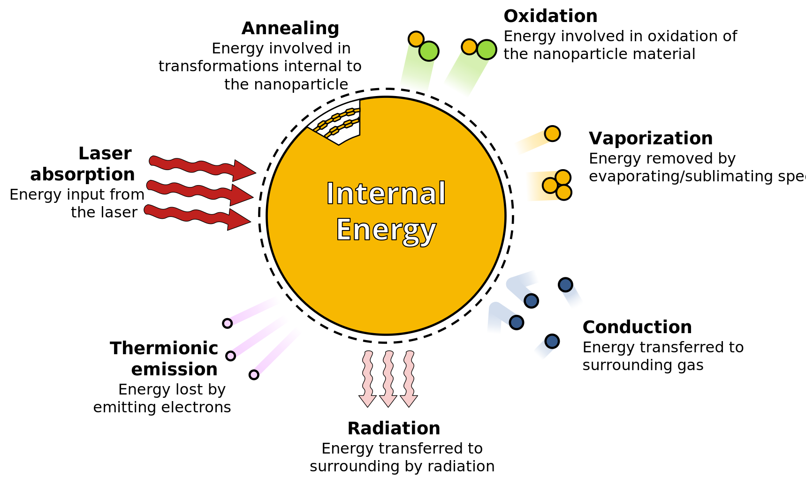

# Modular analysis of LII signals (wat-lii)

[](https://lbesson.mit-license.org/)

This is modular program to model and analyze time-resolved laser-induced incandescence (TiRe-LII) signals, developed at the University of Waterloo.

This program is built to simulate signals from various materials, including soot, silicon, germanium, iron, silver, and molybdenum. Signals are generated predominantly using absorption, conduction, and evaporation submodels, with capabilities to do other cooling modes. The program contain the following components.

<p align="left">
  
</p>


## Getting started

This is under construction and will be coming soon. 

## 1. Upper directory and main\*.m scripts

Throughout the program, `main*.m` scripts are used to create instances of the classes and perform the analysis of LII signals. 

## 2. Classes

This code contains two classes, which are used to define the two different submodels that make up the larger TiRe-LII submodel. 

### 2.1 @HTModel: Heat transfer model

This class is designed to generate temperature decay curves. This is done by solving, at the very least, an ordinary differential equation for temperature. Mass and annealed fraction can also be solved simultaneously.

One can create an instance of the `HTModel` class by calling the construction method:

```Matlab
htmodel = HTModel(prop, x_fields, t, opts);
```

The inputs to the instructor method are as follows:

1. `prop` -  is a Matlab structure that contains all of the physical parameters required to define the heat transfer model. Generating of this structure is described in more detail in [3.1 +props](#31-props), with the precise contents depending on the chosen form of the heat transfer (e.g., whether or not it includes evaporation/sublimation). 

2. The parameter `x_fields` then contains a cell of strings, where each entry is a property of the given `prop` structure. 

3. The `t` input is a vector of time for which the heat transfer model will be evaluated. 

4. Finally, various aspects of the `HTModel` class are controlled using an `opts` structure, which becomes a property of the object. This includes which heat transfer submodels are used in constructing the ordinary differential equation to solve. 

The two key methods for evaluating the heat transfer model are the `evaluate` and `de_solve` methods. The `de_solve` method solves the ODEs without altering the default physical properties. In contrast, the `evaluate` method solves the ODEs for a vector of property values given by the `x` input to the method. The latter is particularly useful in optimization scenerio. 

### 2.2 @SModel: Spectroscopic model

This class is design to simulate incandescence from a temperature trace, incorporating blackbody radiation and the optical properties. Methods exist to both forward and backward (i.e. pyrometry) calculations. 

Instances of the class are created following a similar procedure to `HTModel`. For example, one can create an instance of the class using

```Matlab
smodel = SModel(prop, x_fields, t, l);
```

The inputs are largely the same as before, but with an added `l` argument that defines the wavelenths relevant to the experiment. 

### @Signal

This is depreciated class that is to be replaced by structured arrays. It packages together a series of signals and related information, such as the time and wavelengths. The class is still included for legacy purposes. The class's previous methods were largely moved to the `+data` package, described below. 

## 3. Packages

### 3.1 +props

This class contains the thermosphysical, optical, and other model parameters to be used in evaluating both the spectroscopic and heat transfer models. These parameters are also the ones that can be selected as dependent variables when creating instances of the `HTModel` and `SModel` classes.

This package also includes methods to describe the temperature dependence of various properties, using expressions like the Clausius-Clapeyron or Tolman equations. 

*NOTE*: This package replaces the @Prop class in previous versions to allow for more dynamic/flexible structures. 

### 3.2 +tools

This package contains an assortment of other utilities, including a text-based progress bar and  a function to parse the inputs of various functions. 

### 3.3 +data

The data package is available to filter or otherwise process data. 

-----------------------------------

### License

This software is licensed under an MIT license (see the corresponding file for details).


### Contributions and acknowledgements

The primary author of the code is Timothy A. Sipkens, who can be emailed at  [tsipkens@uwaterloo.ca](mailto:tsipkens@uwaterloo.ca). 

The code was developed at the University of Waterloo. Kyle Daun contributed significantly to the ideas summarized in this code. 